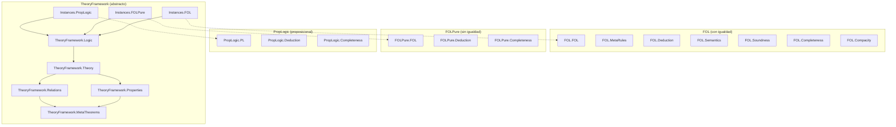

# Diagrama de Dependencias — FOL

**Última actualización:** 2026-07-12
**Autor**: Julián Calderón Almendros

> Este fichero reemplaza la versión anterior, que era la plantilla genérica de
> `lean4-project-template` sin adaptar (título "ProjectName", ejemplos ficticios
> `Prelim.lean`/`Core/Basic.lean`) pese a que el proyecto real tiene 5 `lean_lib` y
> ~70 ficheros `.lean`. Contenido reconstruido a partir de los `import` reales de cada
> barrel (2026-07-12).

---

## Vista de Nivel de Subsistema

Cinco `lean_lib` independientes declaradas en `lakefile.lean`. **No** son una
jerarquía de extensión — son implementaciones paralelas de lógica de primer orden con
distinto alcance (ver ADR-010 en `DECISIONS.md`).

```text
FOL          — lógica de primer orden CON igualdad (De Bruijn), la más completa
FOLPure      — lógica de primer orden SIN igualdad
PropLogic    — lógica proposicional (sin cuantificadores ni términos)
FOL_poli     — variante paralela de FOL (misma estructura, ver nota de barrel abajo)
TheoryFramework — marco abstracto sobre cualquier LogicSystem; se instancia
                  por separado sobre FOL / FOLPure / PropLogic vía Instances/*.lean
                  (nunca sobre dos a la vez en el mismo fichero — colisión de `Formula`)
```



*(línea punteada = dependencia de la instancia hacia la sub-librería concreta;
`TheoryFramework.lean`, el barrel raíz, NO importa ninguna `Instances/*` — se
importan a demanda, ver ADR-010).*

---

## Estructura del Proyecto

```text
FOL/
├── FOL/
│   ├── FOL.lean, MetaRules.lean, Tactics.lean, Tactics2.lean
│   ├── Classical.lean, Deduction.lean, Semantics.lean, Soundness.lean
│   ├── Completeness.lean, Compacity.lean
│   └── Theorems/{Deduction,Derived,Eq,Impl,Neg,Quantifiers,Soundness}.lean
├── FOLPure/          — misma forma que FOL/, sin igualdad, sin Theorems/{Eq,Deduction,Soundness}
├── PropLogic/        — misma forma, sin cuantificadores/términos, sin Theorems/Quantifiers
├── FOL_poli/         — espejo de FOL/ (mismos ficheros, mismo barrel incompleto — ver nota)
├── TheoryFramework/
│   ├── Logic.lean, Theory.lean, Properties.lean, Relations.lean, MetaTheorems.lean
│   └── Instances/{FOL,FOLPure,PropLogic}.lean   (NO importadas por TheoryFramework.lean)
├── FOL.lean / FOLPure.lean / PropLogic.lean / FOL_poli.lean / TheoryFramework.lean  (barrels raíz)
└── lakefile.lean
```

## Dependencias por Sub-librería

### FOL (con igualdad) — barrel `FOL.lean`

Importa: `FOL.FOL`, `MetaRules`, `Tactics`, `Theorems.{Derived,Impl,Neg,Quantifiers}`,
`Deduction`, `Semantics`, `Soundness`, `Completeness`, `Compacity`.

**⚠️ No importados por el barrel** (existen en disco, no wireados — ver ADR-010):
`FOL.Classical`, `FOL.Tactics2`, `FOL.Theorems.{Deduction,Eq,Soundness}`.

### FOLPure (sin igualdad) — barrel `FOLPure.lean`

Importa: `FOLPure.FOL`, `Tactics`, `Classical`, `Theorems.{Impl,Neg,Derived,Quantifiers}`,
`Deduction`, `Semantics`, `Soundness`, `Completeness`, `Compacity`. **Completo** — todos
los ficheros de `FOLPure/` están wireados.

### PropLogic (proposicional) — barrel `PropLogic.lean`

Importa: `PropLogic.PL`, `Tactics`, `Classical`, `Theorems.{Impl,Neg,Derived}`,
`Deduction`, `Semantics`, `Soundness`, `Completeness`, `Compacity`. **Completo**.

### FOL_poli (variante paralela de FOL) — barrel `FOL_poli.lean`

Importa: `FOL_poli.FOL`, `Tactics`, `Theorems.{Derived,Impl,Neg,Quantifiers}`,
`Deduction`, `Semantics`, `Soundness`, `Completeness`, `Compacity`.

**⚠️ No importados por el barrel** (idéntico patrón que `FOL/`):
`FOL_poli.Classical`, `FOL_poli.Tactics2`, `FOL_poli.Theorems.{Deduction,Eq,Soundness}`.

### TheoryFramework (marco abstracto) — barrel `TheoryFramework.lean`

Importa solo el núcleo: `Logic`, `Theory`, `Properties`, `Relations`, `MetaTheorems`.
`Instances/{FOL,FOLPure,PropLogic}.lean` se importan por separado, cada una depende de
`TheoryFramework.Logic` + su sub-librería concreta (`import FOL`, `import FOLPure`,
`import PropLogic` respectivamente). No hay una instancia para `FOL_poli`.

## Exportaciones por Sub-librería (recuento aproximado de ficheros)

| Sub-librería | # ficheros `.lean` | Barrel completo |
|---|---:|---|
| `FOL` | 17 | ❌ (5 huérfanos) |
| `FOLPure` | 12 | ✅ |
| `PropLogic` | 11 | ✅ |
| `FOL_poli` | 16 | ❌ (5 huérfanos, mismo patrón que `FOL`) |
| `TheoryFramework` | 8 | ✅ (por diseño — `Instances/` es opt-in) |

## Notas de Diseño

1. **Sin Mathlib** (ADR-001).
2. **Un namespace por módulo**, refleja la ruta del fichero (ADR-005).
3. **`TheoryFramework` es agnóstico a la lógica concreta** — ver ADR-010 sobre por qué
   sus instancias no se importan todas a la vez.
4. **`FOL_poli` es un espejo de `FOL`**, no una extensión — comparten hasta el patrón
   de módulos huérfanos en el barrel, indicio de que `FOL_poli` se creó copiando la
   estructura de `FOL` en un momento dado y no se ha vuelto a sincronizar desde
   entonces.

## Comandos de Verificación

```bash
lake build              # build completo (las 5 lean_lib)
lake graph              # grafo de dependencias real y completo (Lake nativo)
bash check-sorry.bash   # comprobar sorry restantes
```
