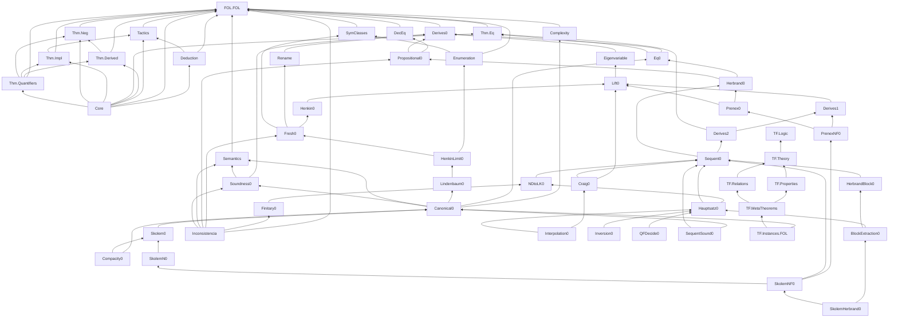

# Diagrama de Dependencias — FOL

**Last updated:** 2026-10-02 — GENERADO por `py gen-dependencies.py` desde las líneas `import`; no se edita a mano.
**Autor**: Julián Calderón Almendros

> ⚠️ Este fichero se **calcula**. Para actualizarlo: `py gen-dependencies.py`; para comprobar que
> está al día: `py gen-dependencies.py --check`. El DEPENDENCIES.md escrito a mano (2026-07-12) se
> sustituyó el 2026-09-26: describía cinco `lean_lib`, tres nodos borrados y ninguno de la capa ₀.

## Cifras

* **54 módulos** (`FOL/` 43 + `FOL/Theorems/` 5 + `TheoryFramework/` 6), **97 aristas** `import` entre ellos, profundidad máxima **12**.
* 2 `lean_lib`: `FOL` (raíz: el barril `FOL.lean`, sin globs) y `TheoryFramework` (globs `.submodules`).
* Módulos que NINGÚN build alcanza: ninguno.
* Imports externos a FOL: `Lean` (FOL no tiene `require`: no depende de nada más allá de sí mismo).

## Por niveles (camino de imports más largo hasta una raíz)

* **0** — `FOL.FOL`, `TF.Logic`
* **1** — `Complexity`, `DecEq`, `Derives0`, `Semantics`, `SymClasses`, `Tactics`, `Thm.Eq`, `Thm.Neg`, `TF.Theory`
* **2** — `Deduction`, `Eigenvariable`, `Enumeration`, `Eq0`, `Propositional0`, `Rename`, `Soundness0`, `Thm.Derived`, `Thm.Impl`, `TF.Properties`, `TF.Relations`
* **3** — `Herbrand0`, `Lift0`, `Thm.Quantifiers`, `TF.MetaTheorems`
* **4** — `Core`, `Derives1`, `Henkin0`, `Prenex0`
* **5** — `Derives2`, `Fresh0`, `PrenexNF0`
* **6** — `HenkinLimit0`, `Sequent0`
* **7** — `Craig0`, `HerbrandBlock0`, `Lindenbaum0`, `NDtoLK0`
* **8** — `Canonical0`, `Finitary0`, `Hauptsatz0`
* **9** — `BlockExtraction0`, `Inconsistencia`, `Interpolation0`, `Inversion0`, `QFDecide0`, `SequentSound0`, `Skolem0`, `TF.Instances.FOL`
* **10** — `Compacity0`, `SkolemN0`
* **11** — `SkolemNF0`
* **12** — `SkolemHerbrand0`

## Grafo

```mermaid
graph BT
    BlockExtraction0["BlockExtraction0"] --> Hauptsatz0["Hauptsatz0"]
    BlockExtraction0["BlockExtraction0"] --> HerbrandBlock0["HerbrandBlock0"]
    Canonical0["Canonical0"] --> Complexity["Complexity"]
    Canonical0["Canonical0"] --> Eq0["Eq0"]
    Canonical0["Canonical0"] --> Lindenbaum0["Lindenbaum0"]
    Canonical0["Canonical0"] --> Semantics["Semantics"]
    Canonical0["Canonical0"] --> Soundness0["Soundness0"]
    Compacity0["Compacity0"] --> Canonical0["Canonical0"]
    Compacity0["Compacity0"] --> Skolem0["Skolem0"]
    Complexity["Complexity"] --> FOL_FOL["FOL.FOL"]
    Core["Core"] --> Deduction["Deduction"]
    Core["Core"] --> FOL_FOL["FOL.FOL"]
    Core["Core"] --> Tactics["Tactics"]
    Core["Core"] --> Thm_Derived["Thm.Derived"]
    Core["Core"] --> Thm_Eq["Thm.Eq"]
    Core["Core"] --> Thm_Impl["Thm.Impl"]
    Core["Core"] --> Thm_Neg["Thm.Neg"]
    Core["Core"] --> Thm_Quantifiers["Thm.Quantifiers"]
    Craig0["Craig0"] --> Lift0["Lift0"]
    Craig0["Craig0"] --> Sequent0["Sequent0"]
    DecEq["DecEq"] --> FOL_FOL["FOL.FOL"]
    Deduction["Deduction"] --> FOL_FOL["FOL.FOL"]
    Deduction["Deduction"] --> Tactics["Tactics"]
    Derives0["Derives0"] --> FOL_FOL["FOL.FOL"]
    Derives1["Derives1"] --> Lift0["Lift0"]
    Derives2["Derives2"] --> Derives1["Derives1"]
    Derives2["Derives2"] --> Thm_Eq["Thm.Eq"]
    Eigenvariable["Eigenvariable"] --> Derives0["Derives0"]
    Enumeration["Enumeration"] --> FOL_FOL["FOL.FOL"]
    Enumeration["Enumeration"] --> SymClasses["SymClasses"]
    Eq0["Eq0"] --> Derives0["Derives0"]
    Eq0["Eq0"] --> Thm_Eq["Thm.Eq"]
    Finitary0["Finitary0"] --> NDtoLK0["NDtoLK0"]
    Fresh0["Fresh0"] --> Henkin0["Henkin0"]
    Fresh0["Fresh0"] --> Rename["Rename"]
    Fresh0["Fresh0"] --> SymClasses["SymClasses"]
    Hauptsatz0["Hauptsatz0"] --> NDtoLK0["NDtoLK0"]
    Hauptsatz0["Hauptsatz0"] --> Sequent0["Sequent0"]
    Henkin0["Henkin0"] --> Lift0["Lift0"]
    HenkinLimit0["HenkinLimit0"] --> Enumeration["Enumeration"]
    HenkinLimit0["HenkinLimit0"] --> Fresh0["Fresh0"]
    Herbrand0["Herbrand0"] --> Eq0["Eq0"]
    Herbrand0["Herbrand0"] --> Propositional0["Propositional0"]
    HerbrandBlock0["HerbrandBlock0"] --> Sequent0["Sequent0"]
    Inconsistencia["Inconsistencia"] --> FOL_FOL["FOL.FOL"]
    Inconsistencia["Inconsistencia"] --> Finitary0["Finitary0"]
    Inconsistencia["Inconsistencia"] --> Fresh0["Fresh0"]
    Inconsistencia["Inconsistencia"] --> Propositional0["Propositional0"]
    Inconsistencia["Inconsistencia"] --> Semantics["Semantics"]
    Inconsistencia["Inconsistencia"] --> Soundness0["Soundness0"]
    Interpolation0["Interpolation0"] --> Craig0["Craig0"]
    Interpolation0["Interpolation0"] --> Hauptsatz0["Hauptsatz0"]
    Inversion0["Inversion0"] --> Hauptsatz0["Hauptsatz0"]
    Lift0["Lift0"] --> Eigenvariable["Eigenvariable"]
    Lindenbaum0["Lindenbaum0"] --> HenkinLimit0["HenkinLimit0"]
    NDtoLK0["NDtoLK0"] --> Sequent0["Sequent0"]
    Prenex0["Prenex0"] --> Herbrand0["Herbrand0"]
    Prenex0["Prenex0"] --> Lift0["Lift0"]
    PrenexNF0["PrenexNF0"] --> Derives1["Derives1"]
    PrenexNF0["PrenexNF0"] --> Prenex0["Prenex0"]
    Propositional0["Propositional0"] --> DecEq["DecEq"]
    Propositional0["Propositional0"] --> Derives0["Derives0"]
    QFDecide0["QFDecide0"] --> Hauptsatz0["Hauptsatz0"]
    Rename["Rename"] --> Derives0["Derives0"]
    Semantics["Semantics"] --> FOL_FOL["FOL.FOL"]
    Sequent0["Sequent0"] --> Derives2["Derives2"]
    Sequent0["Sequent0"] --> Herbrand0["Herbrand0"]
    SequentSound0["SequentSound0"] --> Canonical0["Canonical0"]
    SequentSound0["SequentSound0"] --> Sequent0["Sequent0"]
    Skolem0["Skolem0"] --> Canonical0["Canonical0"]
    SkolemHerbrand0["SkolemHerbrand0"] --> BlockExtraction0["BlockExtraction0"]
    SkolemHerbrand0["SkolemHerbrand0"] --> SkolemNF0["SkolemNF0"]
    SkolemN0["SkolemN0"] --> Skolem0["Skolem0"]
    SkolemNF0["SkolemNF0"] --> PrenexNF0["PrenexNF0"]
    SkolemNF0["SkolemNF0"] --> Sequent0["Sequent0"]
    SkolemNF0["SkolemNF0"] --> SkolemN0["SkolemN0"]
    Soundness0["Soundness0"] --> Derives0["Derives0"]
    Soundness0["Soundness0"] --> Semantics["Semantics"]
    SymClasses["SymClasses"] --> FOL_FOL["FOL.FOL"]
    Tactics["Tactics"] --> FOL_FOL["FOL.FOL"]
    Thm_Derived["Thm.Derived"] --> FOL_FOL["FOL.FOL"]
    Thm_Derived["Thm.Derived"] --> Thm_Neg["Thm.Neg"]
    Thm_Eq["Thm.Eq"] --> FOL_FOL["FOL.FOL"]
    Thm_Impl["Thm.Impl"] --> FOL_FOL["FOL.FOL"]
    Thm_Impl["Thm.Impl"] --> Tactics["Tactics"]
    Thm_Neg["Thm.Neg"] --> FOL_FOL["FOL.FOL"]
    Thm_Quantifiers["Thm.Quantifiers"] --> FOL_FOL["FOL.FOL"]
    Thm_Quantifiers["Thm.Quantifiers"] --> Thm_Derived["Thm.Derived"]
    Thm_Quantifiers["Thm.Quantifiers"] --> Thm_Impl["Thm.Impl"]
    Thm_Quantifiers["Thm.Quantifiers"] --> Thm_Neg["Thm.Neg"]
    TF_Instances_FOL["TF.Instances.FOL"] --> Canonical0["Canonical0"]
    TF_Instances_FOL["TF.Instances.FOL"] --> TF_MetaTheorems["TF.MetaTheorems"]
    TF_MetaTheorems["TF.MetaTheorems"] --> TF_Properties["TF.Properties"]
    TF_MetaTheorems["TF.MetaTheorems"] --> TF_Relations["TF.Relations"]
    TF_Properties["TF.Properties"] --> TF_Theory["TF.Theory"]
    TF_Relations["TF.Relations"] --> TF_Theory["TF.Theory"]
    TF_Theory["TF.Theory"] --> TF_Logic["TF.Logic"]
```

## Tabla

| módulo | nivel | importa | lo importan |
|---|---|---|---|
| `FOL.FOL` | 0 | — | `Complexity`, `Core`, `DecEq`, `Deduction`, `Derives0`, `Enumeration`, `Inconsistencia`, `Semantics`, `SymClasses`, `Tactics`, `Thm.Derived`, `Thm.Eq`, `Thm.Impl`, `Thm.Neg`, `Thm.Quantifiers` |
| `TheoryFramework.Logic` | 0 | — | `TF.Theory` |
| `FOL.Complexity` | 1 | `FOL.FOL` | `Canonical0` |
| `FOL.DecEq` | 1 | `FOL.FOL` | `Propositional0` |
| `FOL.Derives0` | 1 | `FOL.FOL` | `Eigenvariable`, `Eq0`, `Propositional0`, `Rename`, `Soundness0` |
| `FOL.Semantics` | 1 | `FOL.FOL` | `Canonical0`, `Inconsistencia`, `Soundness0` |
| `FOL.SymClasses` | 1 | `FOL.FOL` | `Enumeration`, `Fresh0` |
| `FOL.Tactics` | 1 | `FOL.FOL` · externo: `Lean` | `Core`, `Deduction`, `Thm.Impl` |
| `FOL.Theorems.Eq` | 1 | `FOL.FOL` | `Core`, `Derives2`, `Eq0` |
| `FOL.Theorems.Neg` | 1 | `FOL.FOL` | `Core`, `Thm.Derived`, `Thm.Quantifiers` |
| `TheoryFramework.Theory` | 1 | `TF.Logic` | `TF.Properties`, `TF.Relations` |
| `FOL.Deduction` | 2 | `FOL.FOL`, `Tactics` | `Core` |
| `FOL.Eigenvariable` | 2 | `Derives0` | `Lift0` |
| `FOL.Enumeration` | 2 | `FOL.FOL`, `SymClasses` | `HenkinLimit0` |
| `FOL.Eq0` | 2 | `Derives0`, `Thm.Eq` | `Canonical0`, `Herbrand0` |
| `FOL.Propositional0` | 2 | `DecEq`, `Derives0` | `Herbrand0`, `Inconsistencia` |
| `FOL.Rename` | 2 | `Derives0` | `Fresh0` |
| `FOL.Soundness0` | 2 | `Derives0`, `Semantics` | `Canonical0`, `Inconsistencia` |
| `FOL.Theorems.Derived` | 2 | `FOL.FOL`, `Thm.Neg` | `Core`, `Thm.Quantifiers` |
| `FOL.Theorems.Impl` | 2 | `FOL.FOL`, `Tactics` | `Core`, `Thm.Quantifiers` |
| `TheoryFramework.Properties` | 2 | `TF.Theory` | `TF.MetaTheorems` |
| `TheoryFramework.Relations` | 2 | `TF.Theory` | `TF.MetaTheorems` |
| `FOL.Herbrand0` | 3 | `Eq0`, `Propositional0` | `Prenex0`, `Sequent0` |
| `FOL.Lift0` | 3 | `Eigenvariable` | `Craig0`, `Derives1`, `Henkin0`, `Prenex0` |
| `FOL.Theorems.Quantifiers` | 3 | `FOL.FOL`, `Thm.Derived`, `Thm.Impl`, `Thm.Neg` | `Core` |
| `TheoryFramework.MetaTheorems` | 3 | `TF.Properties`, `TF.Relations` | `TF.Instances.FOL` |
| `FOL.Core` | 4 | `Deduction`, `FOL.FOL`, `Tactics`, `Thm.Derived`, `Thm.Eq`, `Thm.Impl`, `Thm.Neg`, `Thm.Quantifiers` | — |
| `FOL.Derives1` | 4 | `Lift0` | `Derives2`, `PrenexNF0` |
| `FOL.Henkin0` | 4 | `Lift0` | `Fresh0` |
| `FOL.Prenex0` | 4 | `Herbrand0`, `Lift0` | `PrenexNF0` |
| `FOL.Derives2` | 5 | `Derives1`, `Thm.Eq` | `Sequent0` |
| `FOL.Fresh0` | 5 | `Henkin0`, `Rename`, `SymClasses` | `HenkinLimit0`, `Inconsistencia` |
| `FOL.PrenexNF0` | 5 | `Derives1`, `Prenex0` | `SkolemNF0` |
| `FOL.HenkinLimit0` | 6 | `Enumeration`, `Fresh0` | `Lindenbaum0` |
| `FOL.Sequent0` | 6 | `Derives2`, `Herbrand0` | `Craig0`, `Hauptsatz0`, `HerbrandBlock0`, `NDtoLK0`, `SequentSound0`, `SkolemNF0` |
| `FOL.Craig0` | 7 | `Lift0`, `Sequent0` | `Interpolation0` |
| `FOL.HerbrandBlock0` | 7 | `Sequent0` | `BlockExtraction0` |
| `FOL.Lindenbaum0` | 7 | `HenkinLimit0` | `Canonical0` |
| `FOL.NDtoLK0` | 7 | `Sequent0` | `Finitary0`, `Hauptsatz0` |
| `FOL.Canonical0` | 8 | `Complexity`, `Eq0`, `Lindenbaum0`, `Semantics`, `Soundness0` | `Compacity0`, `SequentSound0`, `Skolem0`, `TF.Instances.FOL` |
| `FOL.Finitary0` | 8 | `NDtoLK0` | `Inconsistencia` |
| `FOL.Hauptsatz0` | 8 | `NDtoLK0`, `Sequent0` | `BlockExtraction0`, `Interpolation0`, `Inversion0`, `QFDecide0` |
| `FOL.BlockExtraction0` | 9 | `Hauptsatz0`, `HerbrandBlock0` | `SkolemHerbrand0` |
| `FOL.Inconsistencia` | 9 | `FOL.FOL`, `Finitary0`, `Fresh0`, `Propositional0`, `Semantics`, `Soundness0` | — |
| `FOL.Interpolation0` | 9 | `Craig0`, `Hauptsatz0` | — |
| `FOL.Inversion0` | 9 | `Hauptsatz0` | — |
| `FOL.QFDecide0` | 9 | `Hauptsatz0` | — |
| `FOL.SequentSound0` | 9 | `Canonical0`, `Sequent0` | — |
| `FOL.Skolem0` | 9 | `Canonical0` | `Compacity0`, `SkolemN0` |
| `TheoryFramework.Instances.FOL` | 9 | `Canonical0`, `TF.MetaTheorems` | — |
| `FOL.Compacity0` | 10 | `Canonical0`, `Skolem0` | — |
| `FOL.SkolemN0` | 10 | `Skolem0` | `SkolemNF0` |
| `FOL.SkolemNF0` | 11 | `PrenexNF0`, `Sequent0`, `SkolemN0` | `SkolemHerbrand0` |
| `FOL.SkolemHerbrand0` | 12 | `BlockExtraction0`, `SkolemNF0` | — |

## Barriles

* `FOL.lean` importa 39 módulos.
* `TheoryFramework.lean` importa 5 módulos.

