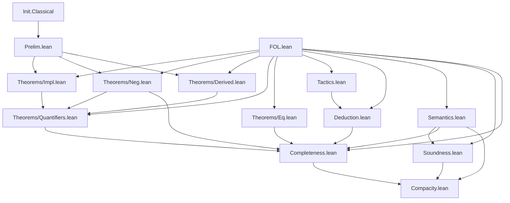

# Technical Reference — ProjectName

> # ⛔⛔ AVISO DE ESTADO — 2026‑09‑12. LEER ANTES QUE NADA
>
> **Este documento estaba fechado en mayo de 2026 y publicaba como hitos demostrados cosas que
> hoy están medidas FALSAS.** Se corrigen abajo las afirmaciones concretas; el resto del texto
> **no se ha reescrito** y debe leerse con esta advertencia delante.
>
> | lo que decía | lo medido |
> |---|---|
> | «Teorema de Corrección (Soundness): `Γ ⊢ A → Γ ⊨ A`» ✅ | ⛔ **NO HAY teorema de Corrección.** `soundness` es **FALSO** en presencia de `FOL/MetaRules.lean`: cualquier testigo suyo demuestra `False` sin hipótesis (`cuarentena/Inconsistencia.lean`, compilado). Está en **`cuarentena/`** |
> | «Compacidad» ✅ | ⛔ Su prueba pasaba por `soundness` ⇒ **vacua**. En `cuarentena/` |
> | «Completitud» ✅ / «1 sorry» | ⚠️ **0 `sorry`, pero UN SOLO `axiom`**: el `sorry` se sustituyó por CINCO postulados en un commit titulado «100 % sorry‑free»; el 2026‑09‑13 cayeron CUATRO (la enumeración de fórmulas y las dos congruencias de la igualdad) y queda **UNO**: `henkin_extension_lemma`. ⭐ `truth_lemma` y el modelo canónico son ya **net‑0 puros**; ⚠️ pero la completitud **sigue sin estar demostrada** en el sentido que aquí se publica. Ver **`AXIOMS.md`** |
> | — | 🏁🏁🏁 **2026‑09‑16: la completitud SÍ está demostrada — pero de `Derives₀`, no de `Derives`.** `FOL.Canonical0.completeness₀`, footprint `[propext, Classical.choice, Quot.sound]`, **cero axiomas del proyecto**, y con `derives0_soundness` las **dos direcciones**. ⛔ Sobre `Derives` sigue siendo imposible: su solidez es FALSA. Ver ADR‑039/040/041 |
> | «4 `lean_lib`, ~43 módulos, 1 sorry, v4.28.0» | **2 `lean_lib`** (`FOL`, `TheoryFramework`) · **4 `axiom`** en el build (+1 en `cuarentena/Completeness.lean`) · **0 sorry** · **v4.31.0**. `FOLPure`, `PropLogic` y `FOL_poli` **retiradas** el 2026‑09‑12 a `cuarentena/librerias-retiradas/` |
>
> ⭐ **Lo único sólido MEDIDO del ecosistema** es `prf0_soundness` sobre `Prf₀`
> (`../ROBINSON_PlusPlus/sondeos/AnclaSoundness.lean`), net‑0 puro.
>
> **Fuentes:** `cuarentena/README.md` · `AXIOMS.md` ·
> `../ROBINSON_PlusPlus/doc/AUDITORIA-FOL-2026-09-12.md`

**Last updated:** 2026-05-08 18:25
**Author**: Julián Calderón Almendros
**Lean version**: v4.28.0

---

## 0. Naming Conventions Guide for the Reader

This project adopts [Mathlib](https://leanprover-community.github.io/contribute/naming.html)-style naming conventions.
Below are the keys for reading and searching theorems.

### 0.1 Capitalization Rules

- **Theorems/lemmas** (Prop): `snake_case` — `union_comm`, `mem_powerset_iff`
- **Prop definitions** (predicates): `UpperCamelCase` — `IsNat`, `IsFunction`; in theorem names → `lowerCamelCase`: `isNat_zero`
- **Functions** (returning values): `lowerCamelCase` — `powerset`, `union`, `sUnion`
- **Acronyms**: as group — `ZFC` (namespace), `zfc` (in snake_case)

### 0.2 Symbol-to-Word Dictionary

| Symbol | Name | | Symbol | Name | | Symbol | Name |
|--------|------|---|--------|------|---|--------|------|
| ∈ | `mem` | | ∪ | `union` | | + | `add` |
| ∉ | `not_mem` | | ∩ | `inter` | | * | `mul` |
| ⊆ | `subset` | | ⋃ | `sUnion` | | - | `sub`/`neg` |
| ⊂ | `ssubset` | | ⋂ | `sInter` | | / | `div` |
| 𝒫 | `powerset` | | \ | `sdiff` | | ^ | `pow` |
| σ | `succ` | | △ | `symmDiff` | | ∣ | `dvd` |
| ∅ | `empty` | | ᶜ | `compl` | | ≤ | `le` |
| = | `eq` | | ⟂ | `disjoint` | | < | `lt` |
| ≠ | `ne` | | ↔ | `iff` | | 0 | `zero` |
| ¬ | `not` | | → | `of` | | 1 | `one` |

### 0.3 Theorem Name Structure

- **Conclusion first**: `isNat_succ_of_isNat` — conclusion (`isNat_succ`) before hypotheses (`of_isNat`) with `_of_`
- **Biconditionals**: suffix `_iff` — `mem_powerset_iff` (∈ 𝒫 ↔ ⊆)
- **Directions of an iff**: `.mp` (→) and `.mpr` (←) — `mem_powerset_iff.mp`
- **Specifications**: `mem_X_iff` — `mem_succ_iff`, `mem_inter_iff`, `mem_union_iff`

### 0.4 Axiomatic Suffixes

| Suffix | Meaning | | Suffix | Meaning |
|--------|---------|---|--------|---------|
| `_comm` | commutativity | | `_self` | op with itself |
| `_assoc` | associativity | | `_left`/`_right` | lateral variant |
| `_refl` | reflexivity | | `_cancel` | cancellation |
| `_trans` | transitivity | | `_mono` | monotonicity |
| `_antisymm` | antisymmetry | | `_inj` | injectivity (iff) |
| `_symm` | symmetry | | `_injective` | injectivity (pred) |

### 0.5 Naming Migration Status

*(Update this section as the project evolves. Example:)*

✅ **Phase 3 completed** (2026-04-21): Names migrated to Mathlib conventions. All FOL modules follow naming conventions perfectly.

---

## 📋 Compliance with AI-GUIDE.md

This document complies with all requirements specified in [AI-GUIDE.md](AI-GUIDE.md):

✅ **(1)** All `.lean` modules documented in section 1.1
✅ **(2)** Dependencies between modules (table with dependencies column)
✅ **(3)** Namespaces and relationships (table with namespace column)
✅ **(4)** Definitions with location, namespace, and declaration order
✅ **(5)** Axioms and definitions with:

- Human-readable mathematical notation
- Lean 4 signature for code usage
- Explicit dependencies
✅ **(6)** Main theorems without proof with:
- Human-readable mathematical notation
- Lean 4 signature for code usage
- Explicit dependencies
✅ **(7)** Only proven/constructed content (no pending items)
✅ **(8)** Continuous update when loading `.lean` files
✅ **(9)** Self-sufficient as sole reference (no need to load entire project)

---

## 1. Module Overview

### 1.1 Module Table

| Module | Namespace | Dependencies | Status |
|--------|-----------|--------------|--------|
| `Prelim.lean` | top-level | `Init.Classical` | ✅ Completo |
| `FOL.lean` | top-level | none | ✅ Completo |
| `Theorems/Impl.lean` | `FOL.Theorems.Impl` | `FOL.FOL`, `FOL.Prelim` | ✅ Completo |
| `Theorems/Neg.lean` | `FOL.Theorems.Neg` | `FOL.FOL`, `FOL.Prelim` | ✅ Completo |
| `Theorems/Derived.lean` | `FOL.Theorems.Derived`| `FOL.FOL`, `FOL.Prelim` | ✅ Completo |
| `Theorems/Quantifiers.lean` | `FOL.Theorems.Quantifiers`| `FOL.FOL`, `FOL.Theorems.Impl`, `FOL.Theorems.Neg`, `FOL.Theorems.Derived` | ✅ Completo |
| `Tactics.lean` | `FOL.Tactics` | `FOL.FOL`, `Lean` | ✅ Completo |
| `Deduction.lean` | `FOL.Metamath.Deduction` | `FOL.FOL`, `FOL.Tactics` | ✅ Completo |
| `Semantics.lean` | `FOL.Metamath.Semantics` | `FOL.FOL` | ✅ Completo |
| `Theorems/Eq.lean` | `FOL.Theorems.Eq` | `FOL.FOL` | ✅ Completo |
| `Enumeration.lean` | `FOL.Metamath.Enumeration` | `FOL.FOL` | ✅ Completo — `natToFormula` y su sobreyectividad, **computables**, cero axiomas (ADR‑030) |
| `Derives0.lean` | *(raíz, como `Derives`)* | `FOL.FOL` | ✅ Completo — **`Derives₀`**: 21 constructores, **cero habitantes‑axioma** ⇒ **inducible**. Paso 0 del plan finitista |
| `Soundness0.lean` | `FOL.Metamath.Soundness0` | `FOL.Derives0`, `FOL.Semantics` | ✅ Completo — **`derives0_soundness`**, y con ella la **consistencia** de `Derives₀` y que **no es sintácticamente completo**. Paso 1 |
| `Rename.lean` | `FOL.Rename` | `FOL.Derives0` | ✅ Completo — **`derives0_rename`**: `Derives₀` respeta el renombrado de símbolos de función. Footprint `[propext, Quot.sound]`. Pieza del Paso 2 (Henkin) |
| `Eigenvariable.lean` | `FOL.Eigenvariable` | `FOL.Derives0` | ✅ Completo — **`derives0_gen_fresh`**: de una constante FRESCA a un `∀`. Footprint `[propext, Quot.sound]`. La otra mitad del Paso 2 |
| `Lift0.lean` | `FOL.Lift0` | `FOL.Eigenvariable` | ✅ Completo — **`derives0_lift`** (debilitamiento bajo levantamiento) y **`derives0_ex_forall_neg_absurd`**. `[propext, Quot.sound]` |
| `Henkin0.lean` | `FOL.Henkin0` | `FOL.Lift0` | ✅ Completo — ⭐⭐ **`henkin_step_consistent`**: añadir el testigo de Henkin con constante fresca preserva la consistencia |
| `Fresh0.lean` | `FOL.Fresh0` | `FOL.Henkin0`, `FOL.Rename` | ✅ Completo — el **suministro de constantes frescas**: `shiftTheory` (la teoría en un sublenguaje, conservativa y equiconsistente) y ⭐ `cst_bound_formula` / `exists_fresh`. Pieza (1) del §6.4 (ADR‑039) |
| `HenkinLimit0.lean` | `FOL.HenkinLimit0` | `FOL.Fresh0`, `FOL.Enumeration` | ✅ Completo — ⭐⭐ la **iteración ω**: `henLimit_consistent` y `henLimit_witness`. **La extensión de Henkin, construida.** Pieza (2) del §6.4 (ADR‑039) |
| `Lindenbaum0.lean` | `FOL.Lindenbaum0` | `FOL.HenkinLimit0` | ✅ Completo — **Lindenbaum sobre `Derives₀`** y ⭐⭐⭐ **`henkin_completion`**: el **ensamblaje de Henkin, cerrado**. ⛔ Aquí vive la no‑finitud del teorema (`if IsConsistent₀ …`, Π⁰₁). Pieza (3) del §6.4 (ADR‑040) |
| `Eq0.lean` | `FOL.Eq0` | `FOL.Derives0`, `FOL.Theorems.Eq` | ✅ Completo — simetría, transitividad y las dos **congruencias** de la igualdad sobre `Derives₀`. ⭐ Traslado **literal** de `Theorems/Eq.lean`; footprint `[propext, Quot.sound]` (ADR‑041) |
| `Canonical0.lean` | `FOL.Canonical0` | `FOL.Lindenbaum0`, `FOL.Eq0`, `FOL.Semantics`, `FOL.Soundness0` | ✅ Completo — 🏁🏁🏁 **`completeness₀ : Γ ⊨ f → Γ ⊢₀ f`** y **`derives0_complete_iff`**. Modelo canónico, `truth_lemma`, y ⭐ `eval_pullback_formula` (**net‑0 puro**). Con controles de **no vacuidad** (ADR‑041) |
| `DecEq.lean` | `FOL.DecEq` | `FOL.FOL` | ✅ Completo — `DecidableEq` **de verdad** para `Term` y `Formula`, **net‑0 pura**. ⛔ `deriving` NO aplica a `Term` (inductivo anidado): la recursión mutua va a mano (ADR‑042) |
| `Propositional0.lean` | `FOL.Propositional0` | `FOL.Derives0`, `FOL.DecEq` | ✅ Completo — 🏁 **H1 y H2** de la vía H: `peval`, Kalmár y ⭐⭐ **`derives0_of_ptaut_ctx`**, la completitud proposicional para `Γ` FINITO. `[propext, Quot.sound]`: **ni un `Classical.choice`** (ADR‑042) |
| `Herbrand0.lean` | `FOL.Herbrand0` | `FOL.Propositional0`, `FOL.Eq0` | ✅ Completo — 🏁 **H4** (mitad ⟸): ⭐⭐ **`derives0_ex_of_cert`**, el certificado de Herbrand, **dato sintáctico y verificable por cómputo** (`ptautCheck` reduce ⇒ `by rfl`). ⬜ H3 **enunciada** como `HerbrandExtraction` con su consumidor `herbrand_iff` (ADR‑043) |
| `Derives1.lean` | *(raíz, como `Derives₀`)* · `FOL.Derives1` | `FOL.Lift0` | ✅ Completo — 🏁 **primera pieza de H3**: ⭐⭐ **`rewrite_at` es ADMISIBLE**. `Derives₁` = los 20 ctors de `Derives₀` **menos `rewrite_at`**, y `derives0_iff_derives1`. ⭐ `Derives₁.rec` **sin ningún axioma** (ADR‑044) |
| `Derives2.lean` | *(raíz)* · `FOL.Derives2` | `FOL.Derives1`, `FOL.Theorems.Eq` | ✅ Completo — 🏁 **segunda pieza de H3**: ⭐⭐ **`subst` es ADMISIBLE** desde tres congruencias primitivas (`eq_substFormula`), más `derives2_lift` y `derives0_iff_derives2`. ⭐ `Derives₂.rec` **sin ningún axioma** (ADR‑045) |
| `Sequent0.lean` | *(raíz)* · `FOL.Sequent0` | `FOL.Derives2`, `FOL.Herbrand0` | ✅ Completo — `LK₀` (14 ctors, sin corte) y `LKc` (15, con corte), **con `eqAx`** —el *theory‑cut*—; ⭐⭐ **`lk0_herbrand`**, la EXTRACCIÓN, que devuelve los términos **y** las instancias de igualdad. ⬜ Queda **`CutElim`** (ADR‑046, revisado en ADR‑049) |
| `SequentSound0.lean` | `FOL.SequentSound0` | `FOL.Sequent0`, `FOL.Canonical0` | ✅ Completo — ⭐ **el molde no prueba de más**: `lkc_sound`/`lk0_sound`, el corolario sintáctico `lk0_to_derives0` **por la semántica** y `lk0_not_empty`. ⚠️ Clásico **por la matemática** (secuentes multiconclusión) (ADR‑048) |
| `NDtoLK0.lean` | `FOL.NDtoLK0` | `FOL.Sequent0` | ✅ Completo — ⭐⭐⭐ **`ndToLK` DEMOSTRADA** (los 22 casos) y **`herbrandExtraction_of_cutElim : CutElim → HerbrandExtraction`**: H3 se queda con **una sola** deuda (ADR‑049) |
| `Hauptsatz0.lean` | *(raíz `LKh`)* · `FOL.Hauptsatz0` | `FOL.Sequent0`, `FOL.NDtoLK0` | 🏁🏁🏁 **EL HAUPTSATZ** — ⭐⭐⭐ `hauptsatz : CutAdm` (el corte es **admisible** en `LK₀`), y de ahí `cut_elimination`, `herbrand_extraction` y ⭐ **`herbrand`**, el teorema de Herbrand **ya incondicional**. Debajo: `LKh` indexado por altura, las dos conmutaciones De Bruijn que faltaban, `lkh_subst`, `lkh_lift` y ⭐⭐ `LeftPrin`, el dato que desacopla los dos análisis de casos. ADR‑050/051/**052** |
| `PrenexNF0.lean` | `FOL.PrenexNF0` | `FOL.Prenex0`, `FOL.Derives1` | 🏁 **La FORMA NORMAL prenexa y su corrección** — ⭐⭐ `derives0_prenex_iff`. La **terminación no hace falta**: las seis fusiones son **estructurales**, porque se recurre sobre un argumento y se LEVANTA el otro. ADR‑058 |
| `Prenex0.lean` | `FOL.Prenex0` | `FOL.Herbrand0`, `FOL.Lift0` | 🏁 **La CAPA PRENEXA**: las **ocho** equivalencias de desplazamiento de cuantificador sobre `Derives₀`. ⭐ «La variable no aparece en `B`» se **construye** (`liftFormula 0 B`), no se comprueba; y las tres direcciones clásicas salen de **constructores**, no de `Classical.choice`. ADR‑057 |
| `Skolem0.lean` | `FOL.Skolem0` | `FOL.Canonical0` | 🏁 **El axioma de Skolem/Henkin es CONSERVATIVO** — ⭐⭐ `evalFormula_updateFunc`, el **lema de coincidencia** que faltaba entre `occursFormula` y `evalFormula` (net‑0, y es el bloqueo que una medición externa señaló); ⭐ el axioma de Skolem **ya estaba escrito**: es `henkinAx`. ADR‑056 |
| `HerbrandBlock0.lean` | `FOL.HerbrandBlock0` | `FOL.Sequent0` | 🔶 **Herbrand para un BLOQUE de existenciales** — ⭐ la mitad ⟸ PAGADA (`derives0_exBlock_of_cert`, incondicional y sin el Hauptsatz) y la mitad ⟹ **enunciada** como `Prop` con su consumidor. ⭐ La pieza de riesgo es `subst_exBlock`, y el índice va `n + k` **a propósito**. ADR‑055 |
| `Compacity0.lean` | `FOL.Compacity0` | `FOL.Canonical0` | 🏁 **COMPACIDAD y LÖWENHEIM–SKOLEM DESCENDENTE** — ⭐ `compactness₀` repara el `compactness_theorem` que `cuarentena/README.md:90` declara **VACUO**; ⭐ `loewenheim_skolem_down`: el modelo canónico **ya era numerable**, faltaba poder decirlo. ADR‑054 |
| `Finitary0.lean` | `FOL.Finitary0` | `FOL.NDtoLK0` (⭐ **no** `Hauptsatz0`) | 🏁 **La consistencia de `Derives₀` SIN `Classical.choice`** — ⭐⭐ `derives0_consistent_fin`, el mismo enunciado que `derives0_consistent` (ADR‑034) con footprint **estrictamente menor**. La clave: `tval`, el modelo de un punto **evaluado a `Bool`** ⇒ el caso `implR` se decide por `cases`, no por tercio excluido. ADR‑053 |

⛔ **Y tres módulos que esta tabla listaba como vivos YA NO LO ESTÁN** (corregido el 2026‑09‑14):
`Soundness.lean`, `Compacity.lean` y `Completeness.lean` están **retirados** a `cuarentena/` desde
el 2026‑09‑11/12 — los dos primeros porque el teorema de solidez para `Derives` es **falso**, el
tercero por sus `axiom` propios. Ver `cuarentena/README.md`.

*Status codes*: ✅ Complete · 🧊 Frozen · 🔶 Partial · 🔄 In progress · ❌ Pending

---

## 2. Dependency Graph



*(Update this diagram as modules are added)*

---

## 3. Module Descriptions

> ⚠️⚠️ **LAS CUATRO ENTRADAS SIGUIENTES DESCRIBEN MÓDULOS QUE YA NO EXISTEN** (auditado el
> 2026‑09‑17): `Prelim.lean` se fusionó, y `Soundness.lean`, `Completeness.lean` y
> `Compacity.lean` están en **`cuarentena/`** desde el 2026‑09‑11/12 (la solidez de `Derives` es
> **falsa**). Se conservan porque su texto explica decisiones vivas, pero **no describen el árbol**.
> ⛔ Y nada las detectaba: el control `[C]` de `check-doc-sync.bash` **sólo miraba los módulos de
> ROBINSON_PlusPlus**, nunca los de FOL. Arreglado el 2026‑09‑17.


### 3.1 Prelim.lean

**Namespace**: top-level (no namespace wrapper)
**Dependencies**: `Init.Classical`
**Last updated**: 2026-04-20 00:00
**Status**: ✅ Completo
**@axiom_system**: `none`
**@importance**: `foundational`

Foundational infrastructure used by all modules: custom `ExistsUnique` with full API,
both `∃!` and `∃¹` notations, dot-notation style and Peano-compatible aliases.

#### ExistsUnique

**Mathematical statement**: p has a unique witness iff ∃ x, p x ∧ ∀ y, p y → y = x

**Lean 4 signature**:

```lean
def ExistsUnique {α : Sort u} (p : α → Prop) : Prop :=
  ∃ x, p x ∧ ∀ y, p y → y = x
```

**Computability**: noncomputable (witness extraction uses `Classical.choose`)
**Dependencies**: `Init.Classical`

**Full API**:

| Name (dot-notation) | Peano alias | Description |
|---------------------|-------------|-------------|
| `ExistsUnique.intro w hw h` | — | constructor |
| `ExistsUnique.exists h` | `ExistsUnique.exists h` | extracts `∃ x, p x` |
| `ExistsUnique.choose h` | `choose_unique h` | noncomputable witness |
| `ExistsUnique.choose_spec h` | `choose_spec_unique h` | witness satisfies p |
| `ExistsUnique.unique h y hy` | `choose_uniq h hy` | uniqueness: `y = witness` |

---

### 3.2 FOL.lean

**Namespace**: top-level
**Dependencies**: none
**Last updated**: 2026-04-21
**Status**: ✅ Completo
**@axiom_system**: `classical`
**@importance**: `foundational`

Provides the core syntax, substitution operations using De Bruijn indices, AST navigation, and the Natural Deduction system with a local rewrite rule mechanism.

**Definitions**:

- `Term`: Inductive type for terms (variables via `#n` and functions).
- `Formula`: Inductive type for formulas (`⊥`, `atom`, `⇒`, `∀.`).
- `neg`, `top`, `lor`, `land`, `iff`, `ex`: Derived logical connectives.
- `liftTerm`, `liftTerms`, `liftFormula`: De Bruijn lifting.
- `substTerm`, `substTerms`, `substFormula`: Substitution of De Bruijn indices.
- `Pos`: Abstract Syntax Tree position path for subformula targeting.
- `getAt?`, `replaceAt`: Operations to query and modify formulas at exact positions.
- `LocalRule`: Allows localized rewrites (e.g., double negation elimination).
- `Derives`: Inductive predicate `Γ ⊢ f` representing natural deduction derivations.

**Notations**:

- `⊥` => `Formula.bottom`
- `⊤` => `top`
- `¬` => `neg`
- ` ∧ ` => `land`
- ` ∨ ` => `lor`
- ` ⇒ ` => `Formula.impl`
- ` ⇔ ` => `iff`
- `∀.` => `Formula.forall`
- `∃.` => `ex`
- `#` => `Term.var`
- ` ⊢ ` => `Derives`

---

### 3.3 Theorems/Impl.lean

**Namespace**: `FOL.Theorems.Impl`
**Dependencies**: `FOL.FOL`, `FOL.Prelim`
**Last updated**: 2026-04-21
**Status**: ✅ Completo
**@axiom_system**: `none`
**@importance**: `high`

Tautologies of implication.

**Theorems**:

- `id_impl`: $A \Rightarrow A$
  `theorem id_impl {Γ A} : Γ ⊢ .impl A A`
- `k_impl`: $A \Rightarrow (B \Rightarrow A)$
  `theorem k_impl {Γ A B} : Γ ⊢ .impl A (.impl B A)`
- `syllogism_impl`: $(A \Rightarrow B) \Rightarrow ((B \Rightarrow C) \Rightarrow (A \Rightarrow C))$
  `theorem syllogism_impl {Γ A B C} : Γ ⊢ .impl (.impl A B) (.impl (.impl B C) (.impl A C))`
- `s_impl`: $(A \Rightarrow (B \Rightarrow C)) \Rightarrow ((A \Rightarrow B) \Rightarrow (A \Rightarrow C))$
  `theorem s_impl {Γ A B C} : Γ ⊢ .impl (.impl A (.impl B C)) (.impl (.impl A B) (.impl A C))`

---

### 3.4 Theorems/Neg.lean

**Namespace**: `FOL.Theorems.Neg`
**Dependencies**: `FOL.FOL`, `FOL.Prelim`
**Last updated**: 2026-04-21
**Status**: ✅ Completo
**@axiom_system**: `classical`
**@importance**: `high`

Properties of negation, explosion, and contrapositive laws.

**Theorems**:

- `explosion_impl`: $\perp \Rightarrow A$
  `theorem explosion_impl {Γ A} : Γ ⊢ .impl ⊥ A`
- `double_neg_intro`: $A \Rightarrow \neg(\neg A)$
  `theorem double_neg_intro {Γ A} : Γ ⊢ .impl A (neg (neg A))`
- `double_neg_elim`: $\neg(\neg A) \Rightarrow A$
  `theorem double_neg_elim {Γ A} : Γ ⊢ .impl (neg (neg A)) A`
- `contrapositive_1`: $(A \Rightarrow B) \Rightarrow (\neg B \Rightarrow \neg A)$
  `theorem contrapositive_1 {Γ A B} : Γ ⊢ .impl (.impl A B) (.impl (neg B) (neg A))`
- `contrapositive_2`: $(\neg B \Rightarrow \neg A) \Rightarrow (A \Rightarrow B)$
  `theorem contrapositive_2 {Γ A B} : Γ ⊢ .impl (.impl (neg B) (neg A)) (.impl A B)`

---

### 3.5 Theorems/Derived.lean

**Namespace**: `FOL.Theorems.Derived`
**Dependencies**: `FOL.FOL`, `FOL.Prelim`
**Last updated**: 2026-04-21
**Status**: ✅ Completo
**@axiom_system**: `classical`
**@importance**: `high`

Properties of derived connectives ($\land$, $\lor$, $\Leftrightarrow$).

**Theorems**:

- `and_intro`: $A \Rightarrow (B \Rightarrow (A \land B))$
- `and_elim_left`: $(A \land B) \Rightarrow A$
- `and_elim_right`: $(A \land B) \Rightarrow B$
- `or_intro_left`: $A \Rightarrow (A \lor B)$
- `or_intro_right`: $B \Rightarrow (A \lor B)$
- `or_elim`: $(A \lor B) \Rightarrow ((A \Rightarrow C) \Rightarrow ((B \Rightarrow C) \Rightarrow C))$
- `excluded_middle`: $A \lor \neg A$
- `and_comm`: $(A \land B) \Rightarrow (B \land A)$
- `or_comm`: $(A \lor B) \Rightarrow (B \lor A)$
- `and_assoc`: $((A \land B) \land C) \Rightarrow (A \land (B \land C))$
- `or_assoc`: $((A \lor B) \lor C) \Rightarrow (A \lor (B \lor C))$
- `de_morgan_1_fwd`: $\neg(A \lor B) \Rightarrow (\neg A \land \neg B)$
- `de_morgan_1_rev`: $(\neg A \land \neg B) \Rightarrow \neg(A \lor B)$
- `de_morgan_1`: $\neg(A \lor B) \Leftrightarrow (\neg A \land \neg B)$
- `de_morgan_2_fwd`: $\neg(A \land B) \Rightarrow (\neg A \lor \neg B)$
- `de_morgan_2_rev`: $(\neg A \lor \neg B) \Rightarrow \neg(A \land B)$
- `de_morgan_2`: $\neg(A \land B) \Leftrightarrow (\neg A \lor \neg B)$

---

### 3.6 Theorems/Quantifiers.lean

**Namespace**: `FOL.Theorems.Quantifiers`
**Dependencies**: `FOL.FOL`, `FOL.Theorems.Impl`, `FOL.Theorems.Neg`, `FOL.Theorems.Derived`
**Last updated**: 2026-04-21
**Status**: ✅ Completo
**@axiom_system**: `classical`
**@importance**: `high`

Quantifier interactions and dualities.

**Axioms**:

- `subst_lift_cancel_formula`: `substFormula v t (liftFormula (v + 1) f) = f`
- `subst_distrib_and`: `substFormula v t (land A B) = land (substFormula v t A) (substFormula v t B)`
- `lift_distrib_and`: `liftFormula c (land A B) = land (liftFormula c A) (liftFormula c B)`

**Theorems**:

- `forall_dne`: $(\forall x. \neg \neg A) \Rightarrow (\forall x. A)$
- `forall_not_impl_exists_not`: $\neg(\forall x. A) \Rightarrow \exists x. \neg A$
- `forall_dni`: $(\forall x. A) \Rightarrow (\forall x. \neg \neg A)$
- `exists_not_impl_forall_not`: $(\exists x. \neg A) \Rightarrow \neg(\forall x. A)$
- `dual_forall_exists`: $\neg(\forall x. A) \Leftrightarrow \exists x. \neg A$
- `forall_and_impl_and_forall`: $(\forall x. A \land B) \Rightarrow (\forall x. A) \land (\forall x. B)$
- `and_forall_impl_forall_and`: $((\forall x. A) \land (\forall x. B)) \Rightarrow (\forall x. A \land B)$
- `distrib_forall_and`: $(\forall x. A \land B) \Leftrightarrow (\forall x. A) \land (\forall x. B)$

---

### 3.7 Tactics.lean

**Namespace**: top-level
**Dependencies**: `FOL.FOL`, `Lean`
**Last updated**: 2026-04-25
**Status**: ✅ Completo
**@axiom_system**: `none`
**@importance**: `high`

Metaprogramming and macros to automate repetitive natural deduction tasks.

**Tactics**:

- `derive_hyp`: Closes goals of the form `Γ ⊢ f` if `f ∈ Γ` via `Derives.hyp` and `List.Mem` resolution.
- `derive_rewrite rule at pos`: Automates the application of a local rewrite rule `LocalRule` at a specific AST position using `Derives.rewrite_at`.
- `derive_weaken thm`: Automatically weakens a theorem `thm`'s context to the current goal's context by resolving `List.Subset` goals automatically.
- `derive_raa`: Applies the Reductio ad Absurdum (`Derives.raa`) rule to change a goal `Γ ⊢ A` into `Γ, ¬A ⊢ ⊥`.

**Definitions**:

- `getAllPositions`: Extracts all valid path positions (`List Pos`) from a given `Formula`.
- `tryMem`: MetaM tactic to prove list membership automatically.

---

### 3.8 Deduction.lean

**Namespace**: `FOL.Metamath.Deduction`
**Dependencies**: `FOL.FOL`, `FOL.Tactics`
**Last updated**: 2026-04-25
**Status**: ✅ Completo
**@axiom_system**: `classical`
**@importance**: `high`

**Theorems**:

- `deduction_theorem`: $(A :: \Gamma \vdash B) \Rightarrow (\Gamma \vdash A \Rightarrow B)$
  `theorem deduction_theorem {Γ A B} (h : A :: Γ ⊢ B) : Γ ⊢ .impl A B`

---

### 3.9 Semantics.lean

**Namespace**: `FOL.Metamath.Semantics`
**Dependencies**: `FOL.FOL`
**Last updated**: 2026-04-25 20:30
**Status**: ✅ Completo
**@axiom_system**: `classical`
**@importance**: `high`

**Definitions**:

- `Model`: Evaluates logic terms and predicates. `structure Model (D : Type)`
- `evalTerm`: Evaluates a `Term` into the model's domain.
- `evalTerms`: Evaluates a list of terms.
- `shiftEnv`: Shifts De Bruijn variable environment.
- `updateEnv`: Updates variable environment at a specific depth $c$.
- `evalFormula`: Computes the truth value of a `Formula`.
- `contextSatisfies`: Checks if an environment satisfies a context $\Gamma$.
- `satisfies`: $Γ \models f$. `def satisfies (Γ : List Formula) (f : Formula) : Prop`

**Theorems**:

- Substitution & Lifting generalizations: `eval_liftTerm_ext`, `eval_liftTerms_ext`, `eval_substTerm_ext`, `eval_substTerms_ext`, `eval_liftFormula_ext`, `eval_substFormula_ext`.
- Base Semantics Lemmas: `updateEnv_zero`, `shiftEnv_updateEnv_comm`, `eval_liftFormula_zero`, `eval_substFormula_zero`, `contextSatisfies_lift_zero`.
- Rewrite Correctness: `rule_soundness`, `replaceAt_soundness`.

---

### 3.10 Soundness.lean

**Namespace**: `FOL.Metamath.Soundness`
**Dependencies**: `FOL.FOL`, `FOL.Metamath.Semantics`, `FOL.Tactics`
**Last updated**: 2026-04-25
**Status**: ✅ Completo
**@axiom_system**: `classical`
**@importance**: `high`

**Theorems**:

- `soundness`: Si $\Gamma \vdash f$, entonces $\Gamma \models f$.
  `theorem soundness {Γ f} (h : Γ ⊢ f) : Γ ⊨ f`

---

### 3.11 Completeness.lean

**Namespace**: `FOL.Metamath.Completeness`
**Dependencies**: `FOL.FOL`, `FOL.Semantics`, `FOL.Deduction`, `Theorems/Eq.lean`
**Last updated**: 2026-05-08 18:25
**Status**: ✅ Completo
**@axiom_system**: `classical`
**@importance**: `foundational`

Demostración del Teorema de Completitud de Gödel para FOL con Igualdad. Construye una teoría de Henkin completa, define un modelo canónico basado en el cociente de términos por la relación de equivalencia sintáctica, y prueba el Lema de la Verdad.

**Definitions**:

- `termEqv`: Relación de equivalencia sintáctica. `t₁ ≈ t₂` si `S ⊢ t₁ = t₂`.
  `def termEqv (S : Theory) (t₁ t₂ : Term) : Prop := S ⊢ .eq t₁ t₂`
- `CanonicalDomain`: El dominio del modelo canónico, definido como el cociente de todos los términos por la relación `termEqv`.
  `def CanonicalDomain (S : Theory) := Quotient (termSetoid S)`
- `canonicalModel`: El modelo canónico para una teoría `S`.
  `def canonicalModel (S : Theory) : Model (CanonicalDomain S)`
- `canonicalEnv`: El entorno canónico que mapea variables a sus clases de equivalencia.
  `def canonicalEnv (S : Theory) : Nat → CanonicalDomain S`

**Theorems**:

- `truth_lemma`: Lema de la Verdad. Una fórmula `f` es derivable si y solo si es verdadera en el modelo canónico.
  `theorem truth_lemma {S : Theory} (hS : IsHenkinTheory S) (f : Formula) : evalFormula (canonicalModel S) (canonicalEnv S) f ↔ S ⊢ f`
- `completeness`: Teorema de Completitud de Gödel. Si `S` satisface semánticamente a `f`, entonces `S` deriva `f`.
  `theorem completeness {S : Theory} {f : Formula} (h : S ⊨ f) : S ⊢ f`

---

### 3.12 Compacity.lean

**Namespace**: `FOL.Metamath.Compacity`
**Dependencies**: `Completeness.lean`, `Soundness.lean`
**Last updated**: 2026-05-08 18:25
**Status**: ✅ Completo
**@axiom_system**: `classical`
**@importance**: `high`

Demostración del Teorema de Compacidad Semántica como corolario de los teoremas de Completitud y Corrección.

**Definitions**:

- `IsSatisfiable`: Una teoría `S` es satisfacible si tiene un modelo.
  `def IsSatisfiable (S : Theory) : Prop := ∃ (D : Type) (M : Model D) (E : Nat → D), ∀ f ∈ S, evalFormula M E f`
- `IsConsistent`: Una teoría `S` es consistente si no puede derivar una contradicción.
  `def IsConsistent (S : Theory) : Prop := S ⊬ ⊥`

**Theorems**:

- `isSatisfiable_iff_isConsistent`: Una teoría es satisfacible si y solo si es consistente.
  `theorem isSatisfiable_iff_isConsistent {S : Theory} : IsSatisfiable S ↔ IsConsistent S`
- `semantic_compactness`: Teorema de Compacidad Semántica. Una teoría `S` es satisfacible si y solo si todo subconjunto finito de `S` es satisfacible.
  `theorem semantic_compactness {S : Theory} : IsSatisfiable S ↔ ∀ S_fin ⊆ S, S_fin.Finite → IsSatisfiable S_fin`

---

### 3.13 Los módulos del plan finitista (2026‑09‑13 → 09‑17)

⭐ **Proyección consolidada.** Estos veintiún módulos nacieron con
`doc/PLAN-COMPLETITUD-FINITISTA.md` (en `../ROBINSON_PlusPlus`) y cada uno lleva su propio
docstring de cabecera con el detalle. Aquí va lo que §14 de AI‑GUIDE exige: **qué demuestra cada
uno y qué cuesta**. Los `export` van en §6.13.

| módulo | qué demuestra | footprint del titular | ADR |
|---|---|---|---|
| `Enumeration.lean` | `natToFormula` y su sobreyectividad, **computables** | `net‑0` | 030 |
| `Derives0.lean` | **`Derives₀`**: 21 ctors, cero habitantes‑axioma ⇒ **inducible** | `—` | 033 |
| `Soundness0.lean` | **`derives0_soundness`**, y con ella consistencia y no‑completitud sintáctica | ``propext, Classical.choice, Quot.sound`` | 034 |
| `Rename.lean` | **`derives0_rename`** y su conservatividad | ``propext, Quot.sound`` | 035 |
| `Eigenvariable.lean` | **`derives0_gen_fresh`**: de constante FRESCA a `∀` | ``propext, Quot.sound`` | 036 |
| `Lift0.lean` | **`derives0_lift`** y `derives0_ex_forall_neg_absurd` | ``propext, Quot.sound`` | 037 |
| `Henkin0.lean` | ⭐⭐ **`henkin_step_consistent`**: el paso de Henkin | ``propext, Classical.choice, Quot.sound`` | 037 |
| `Fresh0.lean` | el **suministro de constantes frescas**; `shiftTheory` conservativa y equiconsistente | ``propext, Classical.choice, Quot.sound`` | 039 |
| `HenkinLimit0.lean` | ⭐⭐ la **iteración ω**: `henLimit_consistent` y `henLimit_witness` | ``propext, Classical.choice, Quot.sound`` | 039 |
| `Lindenbaum0.lean` | **Lindenbaum** y ⭐⭐⭐ **`henkin_completion`**. ⛔ Aquí vive la no‑finitud (Π⁰₁) | ``propext, Classical.choice, Quot.sound`` | 040 |
| `Eq0.lean` | las cuatro piezas de la **igualdad** sobre `Derives₀` | ``propext, Quot.sound`` | 041 |
| `Canonical0.lean` | ⭐⭐⭐ **`completeness₀`** y **`derives0_complete_iff`**; modelo canónico y `truth_lemma` | ``propext, Classical.choice, Quot.sound`` | 041 |
| `DecEq.lean` | `DecidableEq` **de verdad** para `Term` y `Formula` | `**ninguno**` | 042 |
| `Propositional0.lean` | **H1/H2**: `peval`, Kalmár y ⭐⭐ `derives0_of_ptaut_ctx` | ``propext, Quot.sound`` | 042 |
| `Herbrand0.lean` | **H4**: ⭐⭐ `derives0_ex_of_cert`, el certificado, **verificable por cómputo** | ``propext, Quot.sound`` | 043 |
| `Derives1.lean` | ⭐⭐ **`rewrite_at` es ADMISIBLE**; `derives0_iff_derives1` | ``propext, Quot.sound`` | 044 |
| `Derives2.lean` | ⭐⭐ **`subst` es ADMISIBLE** desde tres congruencias; `derives0_iff_derives2` | ``propext, Quot.sound`` | 045 |
| `Sequent0.lean` | `LK₀`/`LKc` y ⭐⭐ **`lk0_herbrand`**, la extracción sin corte | ``propext`` | 046/049 |
| `SequentSound0.lean` | ⭐ **el molde no prueba de más**: `lkc_sound`, `lk0_to_derives0`, `lk0_not_empty` | ``propext, Classical.choice, Quot.sound`` | 048 |
| `NDtoLK0.lean` | ⭐⭐⭐ **`ndToLK`** y `herbrandExtraction_of_cutElim` | ``propext, Quot.sound`` | 049 |
| `Hauptsatz0.lean` | 🏁🏁🏁 **EL HAUPTSATZ**: ⭐⭐⭐ `hauptsatz`, `cut_elimination`, `herbrand_extraction`, `herbrand` | ``propext, Quot.sound`` | 050/051/**052** |
| `Finitary0.lean` | 🏁 **consistencia SIN `Classical.choice`**: ⭐⭐ `derives0_consistent_fin` | ``propext, Quot.sound`` | **053** |
| `Compacity0.lean` | 🏁 **compacidad + LS descendente**: `compactness₀`, `loewenheim_skolem_down` | ``propext, Classical.choice, Quot.sound`` (el WKL) | **054** |
| `HerbrandBlock0.lean` | 🔶 **Herbrand de bloque**: ⭐ `derives0_exBlock_of_cert` (⟸ pagada) | ``propext, Quot.sound`` | **055** |
| `Skolem0.lean` | 🏁 **Skolem CONSERVATIVO**: `henkin_conservative`; ⭐ el lema de coincidencia, **sin axiomas** | ``propext, Classical.choice, Quot.sound`` | **056** |
| `Prenex0.lean` | 🏁 **capa prenexa**: las ocho equivalencias de desplazamiento | ``propext, Quot.sound`` | **057** |
| `PrenexNF0.lean` | 🏁 **forma normal prenexa**: ⭐⭐ `derives0_prenex_iff` | ``propext, Quot.sound`` | **058** |

🔑 **La lectura de la tabla en una línea**: `Derives₀` (033) hace que se pueda *hablar* del
cálculo; `Canonical0` (041) cierra la **vía W** —completitud, con su `Classical.choice`
explicado—; y de `Propositional0` a `Hauptsatz0` va la **vía H**, que es finitaria y a la que
sólo le falta el Hauptsatz.

## 4. Theorems

*(See Module Descriptions in §3 for individual theorems).*

---

## 5. Notations

| Symbol | Expands to | Module | Variants |
|--------|-----------|--------|---------|
| `∃! x, p` | `ExistsUnique (fun x => p)` | `Prelim.lean` | untyped only |
| `∃¹ x, p` | `ExistsUnique (fun x => p)` | `Prelim.lean` | `∃¹ x`, `∃¹ (x)`, `∃¹ (x : T)`, `∃¹ x : T` |
| `⊥` | `Formula.bottom` | `FOL.lean` | |
| `⊤` | `top` | `FOL.lean` | |
| `¬` | `neg` | `FOL.lean` | prefix |
| ` ∧ ` | `land` | `FOL.lean` | infixr |
| ` ∨ ` | `lor` | `FOL.lean` | infixr |
| ` ⇒ ` | `Formula.impl` | `FOL.lean` | infixr |
| ` ⇔ ` | `iff` | `FOL.lean` | infix |
| `∀.` | `Formula.forall` | `FOL.lean` | prefix |
| `∃.` | `ex` | `FOL.lean` | prefix |
| `#` | `Term.var` | `FOL.lean` | prefix |
| ` ⊢ ` | `Derives` | `FOL.lean` | infix |
| ` ⊨ ` | `satisfies` | `Soundness.lean` | infix |

**Note**: `∃!` overrides Lean's built-in notation. Use `∃¹` to avoid any macro conflicts.

---

## 6. Exports

> ⚠️⚠️ **LAS CUATRO ENTRADAS SIGUIENTES DESCRIBEN MÓDULOS QUE YA NO EXISTEN** (auditado el
> 2026‑09‑17): `Prelim.lean` se fusionó, y `Soundness.lean`, `Completeness.lean` y
> `Compacity.lean` están en **`cuarentena/`** desde el 2026‑09‑11/12 (la solidez de `Derives` es
> **falsa**). Se conservan porque su texto explica decisiones vivas, pero **no describen el árbol**.
> ⛔ Y nada las detectaba: el control `[C]` de `check-doc-sync.bash` **sólo miraba los módulos de
> ROBINSON_PlusPlus**, nunca los de FOL. Arreglado el 2026‑09‑17.


### 6.1 Prelim.lean

All names are top-level (no namespace), accessible wherever `Prelim.lean` is imported:

```lean
-- Definitions
ExistsUnique                -- Prop-valued predicate

-- Notation
∃! x, p                    -- unique existence (overrides built-in)
∃¹ x, p                    -- unique existence (safe, 4 variants)

-- Dot-notation API
ExistsUnique.intro
ExistsUnique.exists
ExistsUnique.choose         -- noncomputable
ExistsUnique.choose_spec
ExistsUnique.unique

-- Peano-compatible aliases
choose_unique               -- noncomputable
choose_spec_unique
choose_uniq
```

### 6.2 FOL.lean

Top-level definitions:
`Term`, `Formula`, `neg`, `top`, `lor`, `land`, `iff`, `ex`, `liftTerm`, `liftTerms`, `liftFormula`, `substTerm`, `substTerms`, `substFormula`, `Pos`, `getAt?`, `replaceAt`, `LocalRule`, `Derives`.

### 6.3 Theorems/Impl.lean

Exports from namespace `FOL.Theorems.Impl`:
`id_impl`, `k_impl`, `s_impl`, `syllogism_impl`.

### 6.4 Theorems/Neg.lean

Exports from namespace `FOL.Theorems.Neg`:
`explosion_impl`, `double_neg_intro`, `double_neg_elim`, `contrapositive_1`, `contrapositive_2`.

### 6.5 Theorems/Derived.lean

Exports from namespace `FOL.Theorems.Derived`:
`and_intro`, `and_elim_left`, `and_elim_right`, `or_intro_left`, `or_intro_right`, `or_elim`, `excluded_middle`, `and_comm`, `or_comm`, `and_assoc`, `or_assoc`, `de_morgan_1_fwd`, `de_morgan_1_rev`, `de_morgan_1`, `de_morgan_2_fwd`, `de_morgan_2_rev`, `de_morgan_2`.

### 6.6 Theorems/Quantifiers.lean

Exports from namespace `FOL.Theorems.Quantifiers`:
`subst_lift_cancel_formula`, `subst_distrib_and`, `lift_distrib_and`, `forall_dne`, `forall_not_impl_exists_not`, `forall_dni`, `exists_not_impl_forall_not`, `dual_forall_exists`, `forall_and_impl_and_forall`, `and_forall_impl_forall_and`, `distrib_forall_and`.

### 6.7 Tactics.lean

Metaprogramming macros globally registered into the environment:
`derive_hyp`, `derive_rewrite`, `derive_weaken`, `derive_raa`, `getAllPositions`, `tryMem`.

### 6.8 Deduction.lean

Exports from namespace `FOL.Metamath.Deduction`:
`deduction_theorem`.

### 6.9 Semantics.lean

Exports from namespace `FOL.Metamath.Semantics`:
`eval_liftFormula_zero`, `eval_substFormula_zero`, `contextSatisfies_lift_zero`, `rule_soundness`, `replaceAt_soundness`, `updateEnv_zero`, `shiftEnv_updateEnv_comm`.

### 6.10 Soundness.lean

Exports from namespace `FOL.Metamath.Soundness`:
`soundness`.

### 6.11 Completeness.lean

Exports from namespace `FOL.Metamath.Completeness`:
`termEqv`, `CanonicalDomain`, `canonicalModel`, `canonicalEnv`, `truth_lemma`, `completeness`.

### 6.12 Compacity.lean

Exports from namespace `FOL.Metamath.Compacity`:
`IsSatisfiable`, `IsConsistent`, `isSatisfiable_iff_isConsistent`, `semantic_compactness`.

---

### 6.13 Exports de los módulos del plan finitista

⚠️ Lista **generada del árbol**, no de memoria: todo nombre público (no `private`) de cada
módulo. Es lo que exige AI‑GUIDE §14.

**`Enumeration.lean`** — `unpair`, `unpair_step_down`, `unpair_step_next`, `unpair_reach`, `unpair_surj`, `unpair_sum_le`, `unpair_fst_le`, `unpair_snd_le`, `natToList`, `natToList_surj`, `map_ofNat_toNat`, `natToString`, `natToString_surj`, `natToTerm`, `natToTerms`, `termSize`, `termsSize`, `term_surj_aux`, `natToTerm_surj`, `natToTerms_surj`, `formulaSize`, `natToFormula`, `formula_surj_aux`, `natToFormula_surj`

**`Derives0.lean`** — `Derives₀`, `derives0_to_derives`, `derives0_raa`

**`Soundness0.lean`** — `derives0_soundness`, `Mtrue`, `Mfalse`, `derives0_consistent`, `P`, `derives0_not_derives_P`, `derives0_not_derives_negP`, `derives0_not_complete`

**`Rename.lean`** — `renameTerm`, `renameTerms`, `renameFormula`, `rename_neg`, `rename_liftTerm`, `rename_liftTerms`, `rename_liftFormula`, `rename_substTerm`, `rename_substTerms`, `rename_substFormula`, `rename_getAt?`, `rename_replaceAt`, `rename_localRule`, `map_rename_lift`, `derives0_rename`, `rename_rename_term`, `rename_rename_terms`, `rename_rename_formula`, `map_rename_rename`, `derives0_rename_inv`, `invOf`, `invOf_spec`, `derives0_rename_conservative`, `derives0_rename_iff`

**`Eigenvariable.lean`** — `absTerm`, `absTerms`, `absFormula`, `abs_neg`, `absTerm_lift`, `absTerms_lift`, `absFormula_lift`, `absTerm_subst`, `absTerms_subst`, `absFormula_subst`, `posDepth`, `abs_getAt?`, `abs_replaceAt`, `abs_localRule`, `map_abs_lift`, `absDerives`, `occursTerm`, `occursTerms`, `occursFormula`, `absTerm_eq_lift`, `absTerms_eq_lift`, `absFormula_eq_lift`, `map_abs_eq_map_lift`, `derives0_gen_fresh`, `derives0_inst_fresh`

**`Lift0.lean`** — `liftTerm_lift`, `liftTerms_lift`, `liftFormula_lift`, `liftTerm_subst`, `liftTerms_subst`, `liftFormula_subst`, `lift_getAt?`, `lift_replaceAt`, `lift_localRule`, `map_lift_lift`, `derives0_lift`, `substTerm_lift_var`, `substTerms_lift_var`, `substFormula_lift_var`, `derives0_ex_forall_neg_absurd`

**`Henkin0.lean`** — `DerivesSet₀`, `IsConsistent₀`, `henkinAx`, `neg_impl_left`, `neg_impl_right`, `abs_neg_witness`, `henkin_step_consistent`

**`Fresh0.lean`** — `shift`, `shift_inj`, `cst`, `cst_zero_ne`, `cst_ne_shift`, `cst_inj`, `not_occurs_shiftTerm`, `not_occurs_shiftTerms`, `not_occurs_shiftFormula`, `cst_bound_sym`, `cst_bound_term`, `cst_bound_terms`, `cst_bound_formula`, `cst_bound_list`, `shiftTheory`, `shiftTheory_fresh`, `derivesSet0_shift`, `derivesSet0_shift_inv`, `shiftTheory_consistent`, `exists_fresh`

**`HenkinLimit0.lean`** — `occursTerm_lift`, `occursTerms_lift`, `not_occurs_substTerm`, `not_occurs_substTerms`, `not_occurs_substFormula`, `not_occurs_henkinAx`, `bnd`, `bnd_spec`, `hidx`, `hidx_ge`, `hidx_step`, `hidx_mono`, `hidx_ge_of_le`, `hen`, `hen_mono`, `hen_fresh`, `hen_fresh_at`, `hen_consistent`, `henLimit`, `shiftTheory_sub_henLimit`, `henLimit_finite`, `henLimit_consistent`, `henLimit_witness`

**`Lindenbaum0.lean`** — `derivesSet0_hyp`, `derivesSet0_weakening`, `derivesSet0_intro_impl`, `derivesSet0_elim_impl`, `IsMaximalConsistent₀`, `LindenbaumStep`, `LindenbaumLimit`, `lindenbaum_step_consistent`, `lindenbaum_step_subset`, `lindenbaum_step_mono`, `lindenbaum_limit_bound`, `lindenbaum_lemma`, `max_cons_bot`, `max_cons_contains`, `max_cons_impl`, `IsHenkin₀`, `henkin_completion`

**`Eq0.lean`** — `derives0_eq_symm`, `derives0_eq_trans`, `derives0_eq_func_congr`, `derives0_atom_congr`

**`Canonical0.lean`** — `derivesSet0_map`, `derivesSet0_map2`, `max_cons_impl_iff`, `max_cons_and`, `max_cons_or`, `termEqv`, `termEqv_refl`, `termEqv_symm`, `termEqv_trans`, `termSetoid`, `PointwiseEqv`, `pointwiseEqv_symm`, `termEqv_func_congr`, `termEqv_rel_congr`, `quotientOut`, `quotientOut_eq`, `QuotientDomain`, `canonicalModel`, `canonicalEnv`, `pointwiseEqv_out_mk`, `evalTerm_canonical`, `evalTerms_canonical`, `formulaComplexity`, `complexity_substFormula`, `max_cons_ex`, `max_cons_forall`, `truth_lemma_lt`, `truth_lemma`, `pullback`, `eval_pullback_term`, `eval_pullback_terms`, `eval_pullback_formula`, `IsSatisfiable`, `satisfiable_of_shift`, `model_existence_lemma₀`, `completeness₀`, `derives0_complete_iff`, `derives0_em`, `derives0_peirce`

**`DecEq.lean`** — `decEqTerm`, `decEqTerms`, `instDecidableEqTerm`

**`Propositional0.lean`** — `derives0_em_ctx`, `derives0_cases`, `PVal`, `peval`, `PTaut`, `peval_neg`, `patoms`, `lit`, `kalmar`, `upd`, `upd_self`, `upd_other`, `elim_atoms`, `derives0_of_ptaut`, `implChain`, `peval_implChain`, `derives0_of_implChain`, `derives0_of_ptaut_ctx`, `derives0_em_prop`, `derives0_peirce_prop`

**`Herbrand0.lean`** — `peval_congr`, `pcheck`, `pcheck_sound`, `ptautCheck`, `ptaut_of_check`, `derives0_discharge`, `disjOf`, `herbrandDisj`, `derives0_ex_of_disj`, `eqReflAx`, `eqSymmAx`, `eqTransAx`, `eqFuncAx`, `eqAtomAx`, `EqInstance`, `derives0_of_eqInstance`, `HerbrandCert`, `derives0_ex_of_cert`, `QuantFree`, `HerbrandExtraction`, `herbrand_iff`, `ex_tercio`, `ex_igualdad`

**`Derives1.lean`** — `Derives₁`, `commute_impl_fwd`, `impl_congr_l`, `impl_congr_r`, `and_congr_l`, `and_congr_r`, `or_congr_l`, `or_congr_r`, `forall_congr`, `ex_congr`, `rewrite_equiv`, `rewrite_at_admissible`, `derives1_to_derives0`, `derives0_to_derives1`, `derives0_iff_derives1`

**`Derives2.lean`** — `Derives₂`, `eq_symm`, `eq_trans`, `liftTerms_append`, `derives2_lift`, `PwEq`, `eq_func_pw`, `eq_atom_pw`, `eq_substTerm`, `eq_substTerms`, `eq_substFormula`, `derives1_eq_symm`, `derives1_eq_trans`, `derives1_eq_func_congr`, `derives1_atom_congr`, `derives2_to_derives1`, `derives1_to_derives2`, `derives1_iff_derives2`, `derives0_iff_derives2`

**`Sequent0.lean`** — `LK₀`, `LKc`, `quantFree_subst`, `not_quantFree_ex`, `not_quantFree_all`, `quantFree_of_eqInstance`, `HerbrandOut`, `lk0_herbrand`, `disj_or_allFalse`, `lk0_to_lkc`, `CutElim`, `NDtoLK`, `herbrandExtraction_of`

**`SequentSound0.lean`** — `evalTerms_append`, `evalTerms_hole`, `eqInstance_valid`, `lkc_sound`, `lk0_sound`, `eval_disjOf_of_mem`, `lk0_to_derives0`, `lk0_to_derives2`, `lk0_not_empty`

**`NDtoLK0.lean`** — `wkL`, `wkR`, `axH`, `dneL`, `fnenL`, `mpLK`, `viaEqImpl`, `cutOn`, `ndToLK`, `ndToLK_prop`, `herbrandExtraction_of_cutElim`

**`PrenexNF0.lean`** — `mergeAndR`, `mergeAnd`, `mergeOrR`, `mergeOr`, `mergeImplR`, `mergeImpl`, **`prenex`**, `ImpAll`, `IffAll`, `iffL`, `iffR`, `mkIff`, `impAll_refl`, `iffAll_refl`, `impAll_trans`, `iffAll_trans`, `iffAll_symm`, `impAll_forall`, `impAll_ex`, `impAll_and_l`, `impAll_and_r`, `impAll_or_l`, `impAll_or_r`, `impAll_impl_l`, `impAll_impl_r`, `iffAll_forall`, `iffAll_ex`, `iffAll_and`, `iffAll_or`, `iffAll_impl`, `and_commA`, `or_commA`, `and_forall_r`, `and_ex_r`, `or_forall_r`, `or_ex_r`, `mergeAndR_iff`, `mergeAnd_iff`, `mergeOrR_iff`, `mergeOr_iff`, `mergeImplR_iff`, `mergeImpl_iff`, `prenex_iff`, **`derives0_prenex_iff`**

**`Prenex0.lean`** — `inst_var0`, **`and_forall`**, **`and_ex`**, **`or_forall`**, **`or_ex`**, **`impl_forall_left`**, **`impl_ex_left`**, **`impl_forall_right`**, **`impl_ex_right`**, `Prenex`, `prenex_of_quantFree`

**`Skolem0.lean`** — `updateFunc`, `evalTerm_updateFunc`, `evalTerms_updateFunc`, **`evalFormula_updateFunc`**, `evalTerm_new`, **`henkin_conservative`**

**`HerbrandBlock0.lean`** — `exBlock`, `liftN`, **`subst_exBlock`**, `instB`, `quantFree_instB`, **`derives0_exBlock_of_inst`**, `herbrandDisjBlock`, `derives0_exBlock_of_disj`, `HerbrandCertBlock`, **`derives0_exBlock_of_cert`**, `HerbrandExtractionBlock`, `herbrand_block_iff`, `ex_bloque_igualdad`

**`Compacity0.lean`** — `consistency_of_satisfiable₀`, **`compactness₀`**, `CountableDom`, `IsSatisfiableCountable`, `countable_of_shift`, `model_existence_countable₀`, **`loewenheim_skolem_down`**

**`Finitary0.lean`** — `tval`, `allTrue`, `someTrue`, `tval_lift`, `tval_subst`, `tval_eqInstance`, `allTrue_cons`, `allTrue_tl`, `allTrue_hd`, `allTrue_sub`, `allTrue_lift`, `someTrue_sub`, `someTrue_unlift`, `someTrue_nil`, **`lk0_tval`**, `lk0_empty`, `lk0_no_bot`, **`lkc_tval`**, `lkc_empty`, `lkc_no_bot`, **`derives0_consistent_fin`**, `derives0_not_P_fin`

**`Hauptsatz0.lean`** — `CutAdm`, `cutElim_of`, `LKh`, `lkh_mono`, `lkh_to_lk0`, `lk0_to_lkh`, `liftTerm_subst_le`, `liftTerms_subst_le`, `liftFormula_subst_le`, `substTerm_subst_le`, `substTerms_subst_le`, `substFormula_subst_le`, `eqInstance_subst`, `map_lift_subst`, `map_sub`, `lkh_subst`, `deg`, `deg_subst`, `deg_lift`, `eqInstance_lift`, `lkh_lift`, `sub_cons`, `sub_wk`, `sub_drop`, `swap_cons`, `sub_refl`, `subA_cons`, `subA_wk`, `mem_tl`, `mapA_sub`, `lk0_lift`, `lk0_subst`, `map_subst_lift`, `LeftPrin`, `leftPrin_close`, `leftPrin_mono`, `leftPrin_lift`, `CutAt`, `CutBelow`, `cutOf`, `cutPrinAux`, `cutLeftAux`, `cutAll`, **`hauptsatz`**, **`cut_elimination`**, **`herbrand_extraction`**, **`herbrand`**

### 6.14 Exports de los módulos ANTIGUOS que nadie había proyectado

⚠️⚠️ De los **34** módulos que el control comprueba (todo `FOL/*.lean` y `FOL/Theorems/*.lean`
menos el barril), sólo **7** estaban proyectados y **27 no**. Los 21 del plan finitista están en
§6.13; los **seis** de aquí llevaban **meses** en el árbol sin proyectar, y ⛔ el control `[C]` de
`check-doc-sync.bash` los absolvía: hasta el 2026‑09‑17 **no miraba FOL en absoluto**. Y su
primera versión, ya mirándolo, seguía absolviendo a tres — casaba por **subcadena**
(`Theorems/Eq.lean` daba verde porque `"Eq.lean"` está dentro de `"DecEq.lean"`) y por
**basename** (una sola entrada `Deduction.lean` absolvía a los **dos** ficheros con ese nombre).
🔑 *Un control que casa por subcadena no comprueba: absuelve.*

**`Classical.lean`** — `doubleNegAxiom`, `excludedMiddleAxiom`

**`Core.lean`** — *(barril: sólo `import`s, cero declaraciones propias)*. Es `FOL.FOL`,
`MetaRules`, `Tactics`, `Deduction` y los cinco `Theorems/*`; `FOL.lean` (el de la raíz) es `Core`
**más** `Semantics`, `Enumeration` y toda la escalera finitista.

**`MetaRules.lean`** — `mp`, `imp_intro`, `gen`, `raa`, `dne`, `and_intro`, `and_elim_left`,
`and_elim_right`, `or_intro_left`, `or_intro_right`, `or_elim`, `false_elim`, `ex_intro`,
`ex_elim`, `iff_mp`, `iff_mpr`

⛔⛔ **Cuatro de esos dieciséis son `axiom`** — `imp_intro`, `raa`, `or_elim`, `ex_elim` — y son
**los cuatro habitantes‑axioma de `Derives`**: los que hacen que **M‑11** prohíba
**permanentemente** inducir sobre `Derives` (ADR‑029). Tienen que ser axiomas porque su premisa
**no es positiva** (toma una función de Lean, `Γ ⊢ A → Γ ⊢ B`), y el kernel no la admite como
constructor. ⚠️ Y de ahí sale la otra mitad de la patología: como `raa` toma una **función de
Lean**, `axioms ⊢` **refuta** lo que no prueba ⇒ es **sintácticamente completo** ⇒ ningún
resultado de incompletitud puede enunciarse sobre `⊢` (`Meta/OmegaStrength.lean`, medido).

**`Tactics2.lean`** — las tres macros `prove_mem`, `derive_hyp`, `derive_weaken`

**`Theorems/Deduction.lean`** — `deduction_theorem`

⚠️ **DUPLICADO MEDIDO**: es *letra por letra* el mismo teorema que `FOL/Deduction.lean` (§6.8), en
otro `namespace` (`FOL.Theorems.Deduction` frente a `FOL.Metamath.Deduction`). ⇒ lo que §6.8
proyecta es el **otro** fichero. Quien importa la deducción es `Core.lean`, y lo que importa es
`FOL.Deduction`.

**`Theorems/Eq.lean`** — `substTerm_liftTerm`, `substTerms_liftTerms`, `substTerm_lift_comm`,
`substTerms_lift_comm`, `derive_eq_symm`, `derive_eq_trans`, `substTerm_liftLift`,
`substTerms_liftLift`, `liftTerm_comm_zero`, `liftTerms_comm_zero`, `substFormula_lift_comm`,
`substTerm_lift_comm_zero`, `substTerms_lift_comm_zero`, `substTerm_subst_lift_gen`,
`substTerms_subst_lift_gen`, `subst_subst_lift_gen`, `substTerm_subst_comm_succ`,
`substTerms_subst_comm_succ`, `subst_subst_comm_succ`, `substFormula_liftFormula`,
`substTerms_append`, `substTerms_lift_hole`, `derive_eq_func_congr`, `derive_atom_congr`

⭐ Es **el módulo de conmutaciones De Bruijn del repo**, y por eso importa que estuviera sin
proyectar: `Hauptsatz0.lean` tuvo que **medir dos veces** que le faltaban dos miembros de esta
familia (`liftFormula_subst_le` y `substFormula_subst_le`, §6.13) porque el catálogo no decía
cuáles había. *Un módulo sin proyectar se vuelve a construir.*

⬜ **Huérfanos medidos**: `Classical.lean`, `Tactics2.lean` y `Theorems/Deduction.lean` **no los
importa nadie** del árbol. No se retiran aquí — retirar es una decisión con ADR, no una pasada de
documentación — pero quedan **escritos**.

## 7. Documentation Status

### 7.1 Fully Projected Files

- `Prelim.lean`
- `FOL.lean`
- `Theorems/Impl.lean`
- `Theorems/Neg.lean`
- `Theorems/Derived.lean`
- `Theorems/Quantifiers.lean`
- `Tactics.lean`
- `Deduction.lean`
- `Soundness.lean`
- `Completeness.lean`
- `Compacity.lean`

### 7.2 Partially Projected Files

*(None)*

### 7.3 Notes

*(None)*
